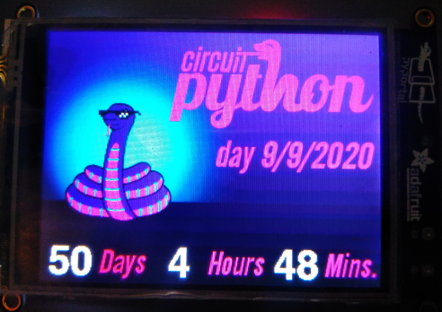

### PyPortal Countdown to Circuit Python Day 2020
This countdown is based on the wonderful guide by John Park: https://learn.adafruit.com/pyportal-event-countdown-clock

### To use this countdown:
* Backup the existing `code.py` file on your PyPortal device
* Make sure you have `secrets.py` with your wifi network credentials
* Copy `circuitpython_day_countdown.py`, `circuitpython_day_countdown_background.bmp`, and `countdown_event.bmp` to your PyPortal `CIRCUITPY` drive
* Rename `circuitpython_day_countdown.py` to `code.py`
